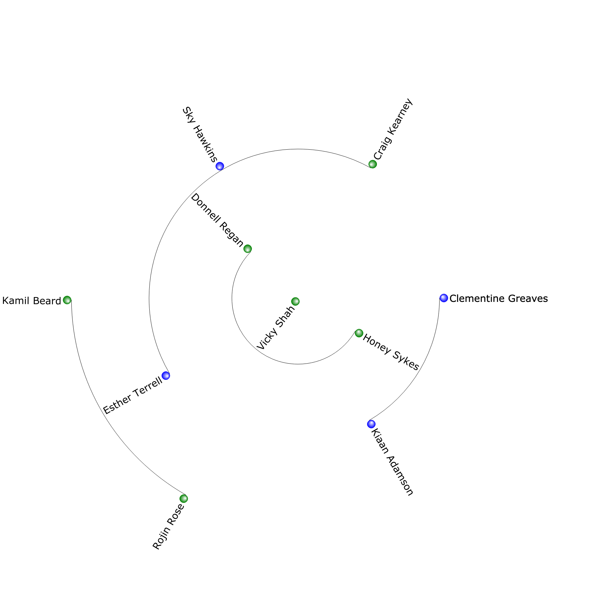

# Table of Contents
<!-- ts -->
* [Org Chart](#org-chart)
    * [Dependencies](#dependencies)
    * [Installation](#installation)
        * [Usage](#usage)
            * [Specifying the filename](#specifying-the-filename)
    * [Example](#example)
<!-- te -->
# Org Chart

A very simple python application to generate an organsiation chart from a CSV 
file. Specifically, one formatted as a circular hierarchy. 

## Dependencies

The project has the following dependencies

* ete3
    * PyQt5
    * scipy
    * six
* click

## Installation

```shell script
virtualenv venv
. venv/bin/activate
pip install . 
```

### Usage

Assuming the virtual environment is activated

```shell script
orgchart --data <csv file> --root <manager>
```

Will produce a file called ``org_chart.py``

#### Specifying the filename

```shell script
orgchart --data <csv file> --root <manager> --file <filename>
```

## Example

```shell script
orgchart --data examples/example.csv --root "Vicky Shah"
```



